# 🔐 Criptografia de Repositórios Privados no GitHub

> Proteja sua propriedade intelectual com criptografia end-to-end usando git-crypt no Windows


---

## 📋 Índice

- [Sobre](#-sobre)
- [Por Que Criptografar?](#-por-que-criptografar)
- [Pré-requisitos](#-pré-requisitos)
- [Instalação](#-instalação)
  - [1. Instalando Dependências](#1-instalando-dependências)
  - [2. Configurando o Ambiente](#2-configurando-o-ambiente)
- [Aplicando Criptografia](#-aplicando-criptografia)
- [Descriptografia em Outra Máquina](#-descriptografia-em-outra-máquina)
- [Troubleshooting](#-troubleshooting)
- [Boas Práticas](#-boas-práticas)
- [Referências](#-referências)

---

## 🎯 Sobre

Este tutorial demonstra como **criptografar arquivos antes de enviá-los para repositórios privados no GitHub**, garantindo segurança adicional contra possíveis vazamentos massivos de dados.

**Primeiro instalaremos as coisas necessárias e dependências para se ter o git-crypt funcional no windows:**

Compilaremos o binário do git-crypt através do **MSYS2**, o MSYS2 é um ambiente que fornece ferramentas Unix-like no Windows, incluindo compiladores como g++ (gcc), o que **permite buildar o git-crypt** diretamente do fonte. O processo envolve instalar MSYS2, configurar o ambiente, clonar o repo oficial e compilar. 
Contudo, para fins de praticidade, também há uma alternativa mais simples usando o gerenciador de pacotes do MSYS2 **(pacman)**, que instala uma versão pré-construída mantida pela comunidade MSYS2 — isso é mais rápido e recomendado (confiando nos repositórios MSYS2, como é open-source, verifique se necessário). Usaremos o pacman nesse exemplo.

**Depois aplicaremos a criptografia no código fonte dos arquivos:**

O git-crypt permite a **criptografia** e **descriptografia** transparente de arquivos em um repositório Git. Os arquivos que você escolher proteger são **criptografados ao serem enviados** (commits) e **descriptografados ao serem retirados** (checkouts). O git-crypt permite que você compartilhe livremente um repositório contendo uma combinação de conteúdo público e privado.

**Por fim, descriptografaremos os arquivos em outra máquina:**

Usando a AWS como exemplo para descriptograr em caso de necessidade de colocar o código/projeto para rodar, compilar ou ser dockerizado posteriormente em **ambiente de produção na nuvem**. 

### 🛡️ Tecnologias Utilizadas

- **[git-crypt](https://github.com/AGWA/git-crypt)** - Criptografia transparente de arquivos no Git
- **[MSYS2](https://www.msys2.org/)** - Ambiente Unix-like para Windows
- **[Visual Studio Code](https://code.visualstudio.com/)** - Editor recomendado
- **[Git](https://git-scm.com/)** - Controle de versão

---

## 🔍 Por Que Criptografar?

> **Mesmo repositórios privados podem estar vulneráveis em futuros casos de:**
> - Vazamentos massivos de dados
> - Comprometimento de credenciais
> - Acesso não autorizado à plataforma</br></br>

> **Riscos de Confiar Apenas na Privacidade do Repositório:**</br></br>
> O GitHub é projetado para ser seguro, com criptografia em repouso e em trânsito, controles de acesso rigorosos e conformidades como SOC 2. Milhões de empresas confiam nele diariamente sem problemas. No entanto, 2025 viu vários incidentes que expuseram riscos reais para repositórios privados:
> - Vulnerabilidades no GitHub Copilot permitiram exfiltração silenciosa de segredos e código fonte privado (ex: CamoLeak, CVSS 9.6, descoberta em junho de 2025). [[1]](#-referências)
> - Ataques de supply chain, como no tj-actions/changed-files, impactaram mais de 23.000 repositórios, incluindo privados, com modificações retroativas. [[2]](#-referências)
> - O "MCP Horror Stories" envolveu injeção de prompts no GitHub Managed Code Pipeline, levando a vazamentos cross-repository de dados privados em agosto de 2025. [[3]](#-referências)
> - Estudos mostraram que 65% das top empresas de AI vazaram segredos no GitHub em 2025, expondo dados sensíveis. [[4]](#-referências)
> - Outros casos incluem malvertising levando a info stealers hospedados no GitHub (março 2025) e vulnerabilidades no Copilot/Visual Studio permitindo manipulação de comandos. [[5]](#-referências) </br>

> Esses não foram "vazamentos totais de todos os repos privados" pela Microsoft, mas exploits direcionados ou erros de configuração que afetaram usuários específicos. A Microsoft/GitHub respondeu rapidamente na maioria dos casos, desabilitando repos maliciosos e emitindo patches. Ainda assim, se hipoteticamente houver um breach massivo no futuro, a privacidade sozinha não protegeria o conteúdo — ele poderia ser exposto comprometendo a propriedade intelectual de milhões de códigos-fonte de diversos negócios/empresas.

### Benefícios da Criptografia

| Vantagem | Descrição |
|----------|-----------|
| 🔒 **Segurança Extra** | Proteção adicional além da privacidade do repositório |
| 🛡️ **Propriedade Intelectual** | Código ilegível mesmo em caso de leak |
| 🔑 **Controle de Acesso** | Apenas quem possui a chave pode descriptografar |
| 📦 **Transparente** | Funciona nativamente com workflows Git |

---

## 📦 Pré-requisitos

Antes de começar, certifique-se de ter:

- [ ] **Windows 10/11** (x86_64 ou ARM64)
- [ ] **Git** instalado e configurado
- [ ] **Visual Studio Code** ou editor de sua preferência
- [ ] **Conexão SSH com GitHub** configurada
- [ ] **Conhecimento básico** de Git e terminal

> Para Linux, consulte o [repositório oficial do git-crypt](https://github.com/AGWA/git-crypt)

---

## 🚀 Instalação

### 1. Instalando Dependências

#### Passo 1.1: Verificar Arquitetura do Sistema

Antes de baixar o MSYS2, identifique a arquitetura do seu Windows:

1. Abra **Configurações** → **Sistema** → **Sobre**
2. Procure por:
   - `Processador baseado em x64` = **x86_64** (Arquitetura que está sendo usada como referência neste tutorial)
   - Qualquer referência a `ARM` = **ARM64**

<br>

<p align="center">
  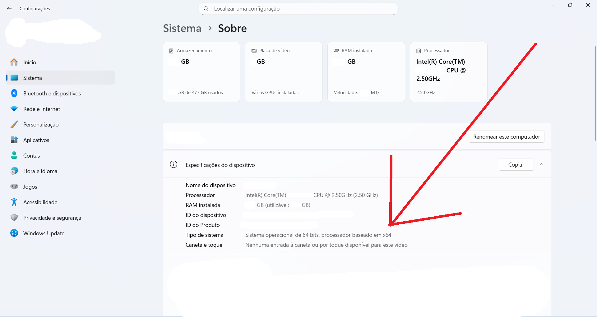<br>
  <em>Figura 1: Tela de verificação da arquitetura do sistema</em>
</p>

#### Passo 1.2: Baixar e Instalar MSYS2

1. Acesse o site oficial: **https://www.msys2.org/**
2. Baixe o instalador correspondente à sua arquitetura
3. Execute o instalador

> Use um caminho simples de instalação como `C:\msys64`. Evite espaços, acentos ou caracteres especiais no caminho!

<p align="center">
  <br>
  <em>Figura 2: Tela de caminho de instalação do MSYS2</em>
</p>

#### Passo 1.3: Atualizar o Sistema MSYS2

Após a instalação, o terminal **MSYS2 UCRT64** será aberto automaticamente.

```bash
# Atualize o sistema rodando o comando:
pacman -Syu
```

Confirme com `Y` se solicitado.

<p align="center">
  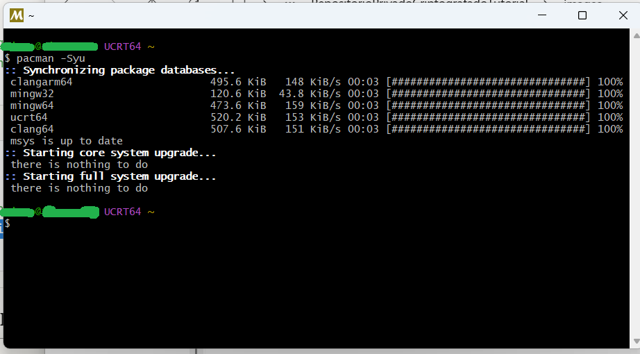<br>
  <em>Figura 3: Atualizando sistema do MSYS2 com pacman -Syu</em>
</p>

> Se solicitado, feche e reabra o terminal MSYS2 UCRT64 após a instalação.

#### Passo 1.4: Instalar Ferramentas de Compilação

No terminal **MSYS2 UCRT64** novamente, instale o GCC:

```bash
# Instalar o compilador GCC
pacman -S mingw-w64-ucrt-x86_64-gcc
```

Confirme com `Y` quando solicitado.

<p align="center">
  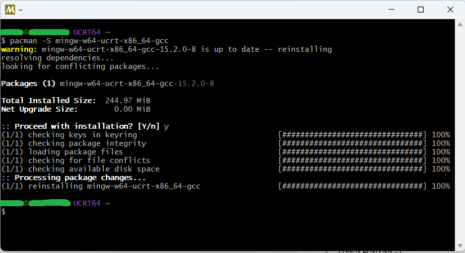<br>
  <em>Figura 4: Instalando compilador mingw-w64-ucrt-x86_64-gcc</em>
</p>

<details>
<summary>🔧 Solução alternativa (caso haja problemas)</summary> <br>

Se algo der errado, feche o terminal atual **UCRT64**. No "iniciar" do windows digite "msys2", deve aparecer uma lista de terminais msys2, abra o terminal **MINGW64** e nele jogue o seguinte comando:

```bash
pacman -S mingw-w64-x86_64-gcc mingw-w64-x86_64-make mingw-w64-x86_64-openssl
```

Confirme com `Y` quando solicitado.

</details>

<br>

**Verificando a instalação:**

Você sabe que fez tudo certo quando digita "gcc --version" e a versão aparece. Digite também "g++ --version" e as versões devem aparecer.

```bash
gcc --version
g++ --version
```

<p align="center">
  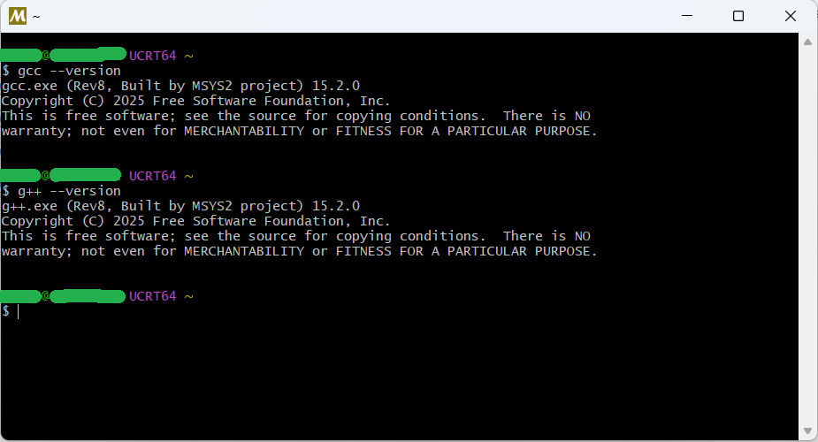<br>
  <em>Figura 5: Confirmando instalação gcc</em>
</p>

#### Passo 1.5: Instalar git-crypt

Agora o git-crypt está pronto para ser instalado. Usando a versão pré-construida via pacman, é importante que feche o terminal atual, e abra o **MSYS2 MSYS**:

```bash
# Atualize novamente o sistema rodando o comando:
pacman -Syu

# Após isso, instale o git-crypt com o comando:
pacman -S git-crypt
```

Confirme com `Y` se solicitado.

**Verificando a instalação:**

```bash
# Rode para checar:
git-crypt --version
```

A versão atual do git-crypt deve aparecer.

<p align="center">
  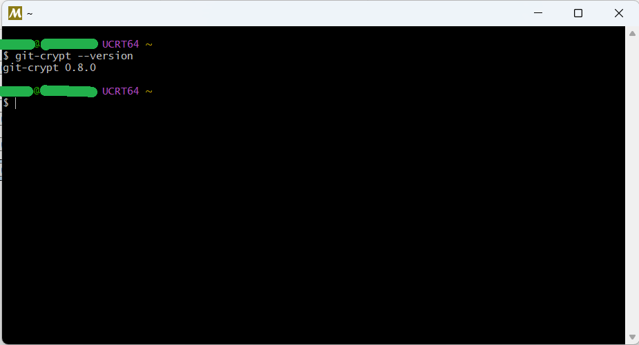<br>
  <em>Figura 6: Confirmando instalação git-crypt</em>
</p>

### 2. Configurando o Ambiente

#### Passo 2.1: Adicionar git-crypt ao PATH do Sistema

O executável "git-crypt.exe" foi criado. Agora, adicionalmente a instalação, é necessário colocar o git-crypt ao PATH do sistema para que ele possa ser usado e executado em qualquer terminal de prompt de comando, pois atualmente ele está sendo usado apenas pelo terminal do MSYS2.

O executável está localizado em: `C:\msys64\usr\bin\git-crypt.exe`

Para usá-lo em qualquer terminal (CMD/PowerShell):

1. Pressione `Win + S` ou abra o menu "iniciar" do windows e digite: **"editar as variáveis de ambiente do sistema"**
2. Clique em **"Variáveis de Ambiente"**
3. Em **"Variáveis do sistema"**, selecione **"Path"** → **"Editar"**
4. Clique em **"Novo"** e adicione: `C:\msys64\usr\bin`
5. Clique **"OK"** em todas as janelas

<p align="center">
  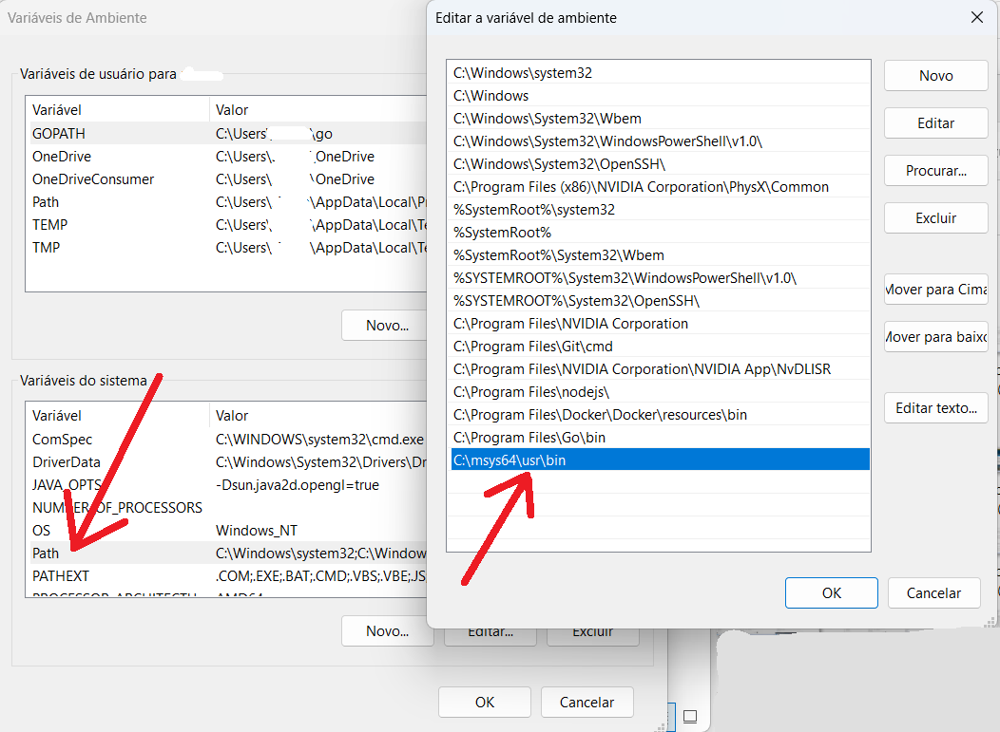<br>
  <em>Figura 7: Adicionando git-crypt ao PATH</em>
</p>

#### Passo 2.2: Verificar Configuração

Feche todos os terminais abertos, abra o **CMD** ou **PowerShell** e teste:

```bash
git-crypt --version
```

✅ Se a versão aparecer, a instalação foi bem-sucedida!

<p align="center">
  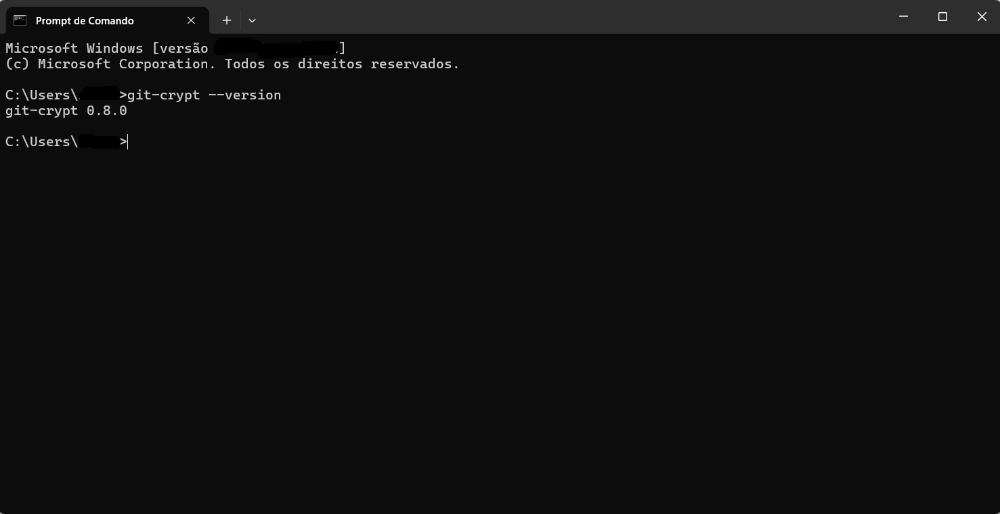<br>
  <em>Figura 8: Confirmando git-crypt adicionado ao PATH</em>
</p>

---

## 🔒 Aplicando Criptografia

Agora com o git-crypt instalado, é hora de criptografar os arquivos do projeto para que o código-fonte não possa ser lido por pessoas não autorizadas, mesmo que algum dia haja vazamento de dados de repositórios privados do github, garantindo assim a segurança completa em deixar o código hospedado em um repositório privado. Para descriptografá-lo em outra máquina, caso precise containerizar a aplicação com Docker ou executá-la de alguma forma em outro ambiente ou na nuvem, será necessário rodar o comando de descriptografia nessa outra máquina usando a chave (.key) gerada nesse processo atual.

Antes de começar, **é importante saber que a criptografia não é aplicada aos arquivos de commits anteriores no git**, portanto, se sua aplicação já estiver sido commitada antes, será necessário colocá-la em uma nova pasta, sem a pasta ".git" inicializada ainda, para que os commits anteriores não subam para o novo repositório privado do Github. Isso é necessário pois qualquer commit de código feito anteriormente à criptografia terá o código exposto normalmente. Se faz questão de que todo o código esteja criptografado desde o início, crie uma nova pasta para o projeto e copie tudo para essa nova pasta (sem a pasta invisível .git).

### Passo 1: Preparar o Projeto

> **Nota: A criptografia não afeta commits anteriores!** 
> 
> Se seu projeto já tem histórico no Git, crie uma nova pasta e copie apenas os arquivos (sem a pasta `.git`). Caso contrário, commits antigos permanecerão sem criptografia.

#### Configurar SSH com GitHub

Se ainda não configurou, siga a documentação oficial:

1. [Gerar chave SSH](https://docs.github.com/pt/authentication/connecting-to-github-with-ssh/generating-a-new-ssh-key-and-adding-it-to-the-ssh-agent)
2. [Adicionar chave ao GitHub](https://docs.github.com/pt/authentication/connecting-to-github-with-ssh/adding-a-new-ssh-key-to-your-github-account)

### Passo 2: Inicializar Git e git-crypt

Abra seu projeto no **Visual Studio Code** e abra o terminal integrado:

```bash
# Inicialize o repositório Git
git init

# E inicialize o git-crypt
git-crypt init
```
<p align="center">
  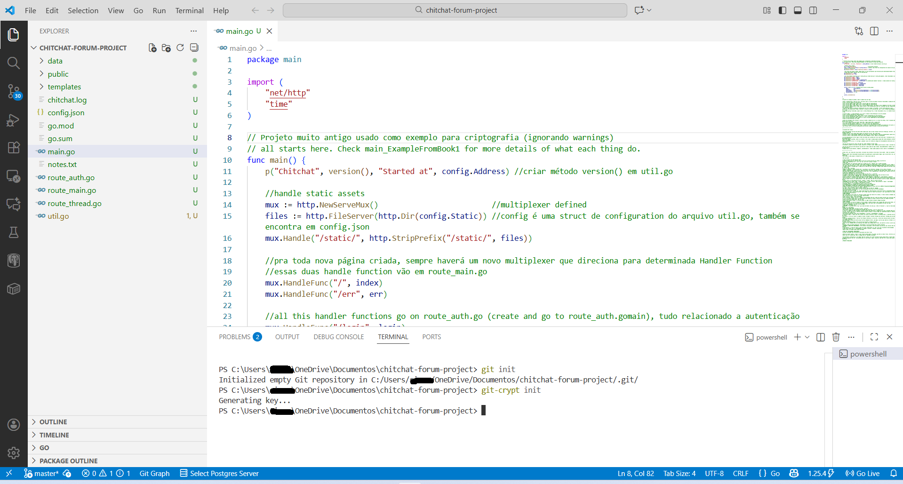<br>
  <em>Figura 9: Inicializando git e git-crypt no projeto a ser criptografado</em>
</p>

Coisas a se notar: 
Não há um arquivo .gitattributes criado ainda na raiz do projeto.
Os arquivos do projeto ainda não foram adicionados ao stage com "git add ." ou commitados.
Foi gerada uma chave criptográfica para o projeto em "Generating key..."


### Passo 3: Configurar Arquivos para Criptografia

Crie um arquivo `.gitattributes` na raiz do projeto com o seguinte conteúdo:

```gitattributes
** filter=git-crypt diff=git-crypt
.gitattributes !filter !diff
```

**Explicação:**
- `**` = Criptografa todos os arquivos
- `.gitattributes !filter !diff` = Exclui o próprio .gitattributes (evita loops)

Agora sim, `.gitattributes` criado.

<p align="center">
  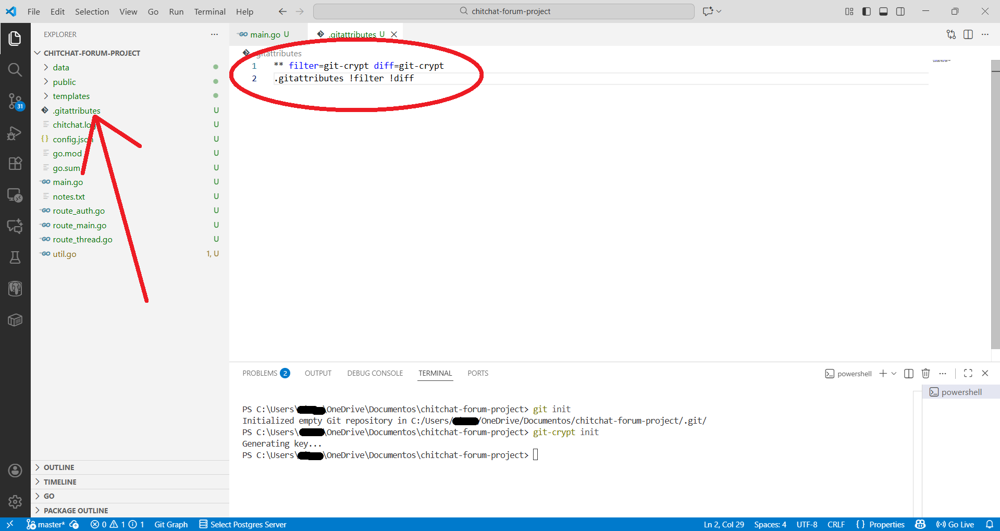<br>
  <em>Figura 10: Criando o .gitattributes</em>
</p>

### Passo 4: Commit Inicial (Configuração)

```bash
# Adicione apenas o .gitattributes ao stage primeiro para que apenas ele seja commitado inicialmente, rode:
git add .gitattributes

# Depois execute o Commit da configuração
git commit -m "Configurando criptografia para o repositório inteiro"
```

<p align="center">
  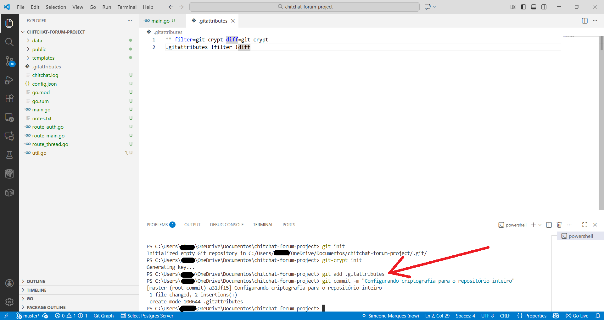<br>
  <em>Figura 11: Commitando o .gitattributes</em>
</p>

### Passo 5: Exportar Chave de Criptografia

Agora é o momento de exportar a chave criptográfica criada anteriormente.

> **NUNCA commite a chave no repositório!** Guarde-a em local seguro. Somente com ela será possível descriptografar o código em outra máquina posteriormente.

```bash
# Para exportar a chave simétrica, rode o comando:
git-crypt export-key C:\caminho\seguro\chave.key

# Obviamente substituindo o caminho para o local adequado onde vai salvar a chave em sua máquina 
```

<p align="center">
  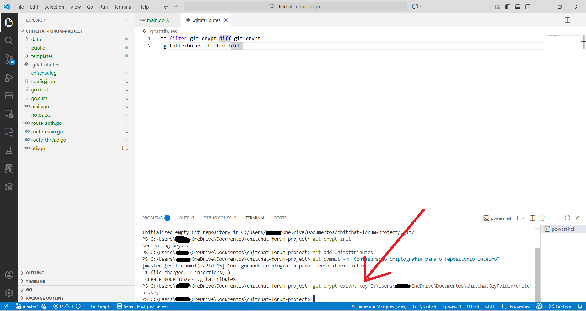<br>
  <em>Figura 12: Exportando key. Navegue até a pasta onde a salvou para verificar, ela deve estar lá</em>
</p>

**Locais seguros para guardar a chave:**
- 🔐 Gerenciadores de senha (LastPass, 1Password, Bitwarden)
- ☁️ AWS Secrets Manager
- 💾 Drive criptografado local
- 🔑 Cofre físico (USB criptografado)

### Passo 6: Adicionar e Commitar Arquivos Criptografados

Finalmente, agora é o momento de commitar todo o projeto para criptografá-lo.

```bash
# Adicione todos os arquivos do projeto ao stage com:
git add .

# Dê o Commit com criptografia automática:
git commit -m "Primeiro commit que adiciona criptografia a todos os arquivos"
```

<p align="center">
  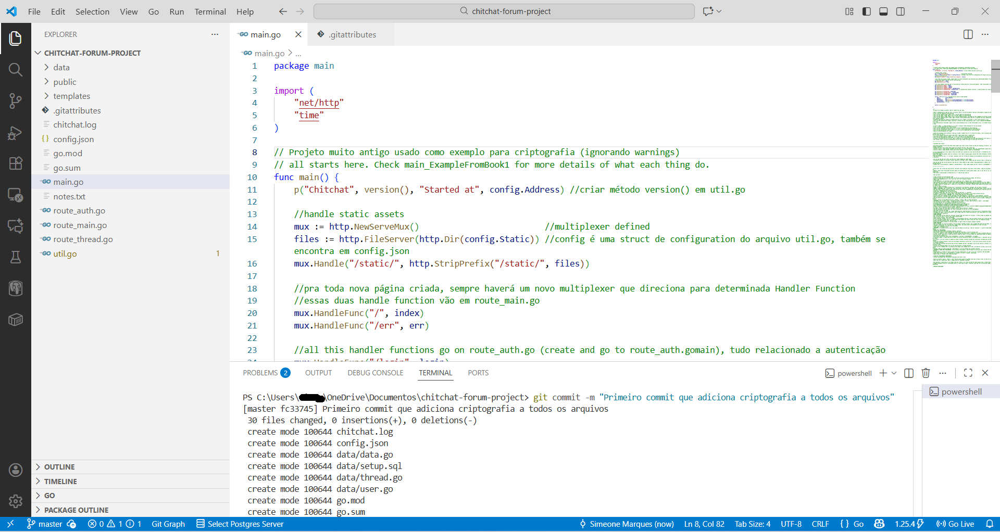<br>
  <em>Figura 13: Criptografando os arquivos</em>
</p>

### Passo 7: Verificar Criptografia

Para confirmar que os arquivos foram criptografados, abra o CMD na pasta do projeto e rode o seguinte comando para o arquivo que se quer ver:

```bash
# Para visualizar o arquivo criptografado, no meu caso poderia rodar no CMD:
git show HEAD:main.go

#ou
git show HEAD:route_main.go

#e etc. No seu caso rode:
git show HEAD:nome_do_seu_arquivo.extensão
```

<p align="center">
  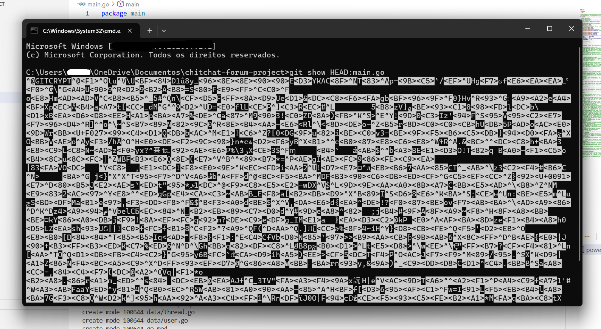<br>
  <em>Figura 14: É assim que o código deverá ser mostrado</em>
</p>

### Passo 8: Enviar para GitHub

#### 8.1: Criar Repositório no GitHub

Acesse o GitHub e crie um novo repositório privado.

#### 8.2: Conectar ao Repositório Remoto

```bash
# Verificar se não há remoto configurado
git remote -v

# Adicionar repositório remoto
git remote add origin git@github.com:seu-usuario/seu-repo-privado.git

# Verificar novamente
git remote -v
```

#### 8.3: Fazer Push

```bash
# Enviar código criptografado para o GitHub
git push -u origin master
```

✅ **Pronto!** Seu código está criptografado e seguro no GitHub.

---

## 🔓 Descriptografia em Outra Máquina

Usando a **AWS** como exemplo. Acesse o AWS Management e abra o CloudShell para seguir com a descriptografia. O mesmo deve ser vir também para qualquer outro ambiente de nuvem, máquina remota ou outra máquina física local.

### Passo 1: Clonar o Repositório

Acesse o **AWS Management Console** → **CloudShell**

```bash
# Clone o repositório (arquivos vêm criptografados) com o comando:
git clone https://seu-token@github.com/seu-usuario/seu-repo-privado.git

# Entre no diretório
cd seu-repo-privado
```

> Neste ponto, os arquivos ainda estão criptografados e ilegíveis

### Passo 2: Instalar git-crypt no CloudShell

Aqui é basicamente a repetição do passo de instalação do git-crypt, mas como o CloudShell usa linux, o processo de instalação é referente ao linux.

```bash
# Clone o repositório do git-crypt com:
git clone https://github.com/AGWA/git-crypt.git

# Depois de baixado navegue até a pasta
cd git-crypt

# Instale as dependências com:
sudo yum install -y make gcc openssl-devel

# Se não funcionar, rode sem o devel no final:
sudo yum install -y make gcc openssl

# Compile e instale localmente com os comandos:
make
sudo make install PREFIX=$HOME/.local
export PATH=$HOME/.local/bin:$PATH

# Volte ao diretório do projeto com:
cd ../seu-repo-privado

# E verifique instalação
git-crypt --version
```

### Passo 3: Transferir a Chave

Há algumas maneiras de fazer isso:

**Opção 1: Upload via Console (mais simples)**

1. No CloudShell, clique em **"Actions"** → **"Upload file"**
2. Selecione seu arquivo `chave.key`

**Opção 2: AWS Secrets Manager**

```bash
# Recuperar chave do Secrets Manager
aws secretsmanager get-secret-value \
  --secret-id seu-segredo-chave \
  --query SecretString \
  --output text > chave.key
```

**Opção 3: Transferindo via SSH**, **Opção 4: colocando-a em um bucket S3** e etc.

### Passo 4: Descriptografar

Aqui é o passo onde se desbloqueia o código criptografado.

```bash
# Desbloqueie o repositório com a chave
git-crypt unlock ./chave.key
```

✅ **Arquivos agora estão descriptografados e legíveis!**

### Passo 5: Limpeza de Segurança

```bash
# Remover chave após uso (importante!)
rm chave.key
```

> A sessão do CloudShell expira automaticamente, mas é boa prática limpar dados sensíveis

---

## ⚠️ Troubleshooting

<details>
<summary>❌ Erro: "git-crypt não é reconhecido como comando"</summary>

**Solução:**
1. Verifique se `C:\msys64\usr\bin` está no PATH do sistema
2. Reinicie todos os terminais abertos
3. Execute `where git-crypt` no CMD para verificar o caminho

</details>

<details>
<summary>❌ Erro: "pacman: command not found"</summary>

**Solução:**
- Certifique-se de estar usando o terminal correto do MSYS2
- Para instalar git-crypt, use **MSYS2 MSYS**, não UCRT64

</details>

<details>
<summary>❌ Arquivos não estão sendo criptografados</summary>

**Solução:**
1. Verifique o conteúdo do `.gitattributes`
2. Certifique-se de que commitou o `.gitattributes` **antes** dos outros arquivos
3. Execute `git-crypt status` para verificar o estado

</details>

<details>
<summary>❌ Erro ao compilar no CloudShell</summary>

**Solução:**
```bash
# Instalar todas as dependências necessárias
sudo yum install -y git make gcc-c++ openssl-devel
```

</details>

---

## ✅ Boas Práticas

### Segurança da Chave

| ✅ Fazer | ❌ Não Fazer |
|---------|-------------|
| Guardar em gerenciador de senhas | Commitar no repositório |
| Usar serviços como AWS Secrets Manager | Enviar por email não criptografado |
| Backup em múltiplos locais seguros | Deixar na área de trabalho |
| Rotacionar chaves periodicamente | Compartilhar sem controle de acesso |

### Workflow Recomendado

1. **Nunca commite antes de configurar criptografia**
2. **Sempre verifique com `git-crypt status`**
3. **Faça backup da chave em local seguro**
4. **Documente o processo para a equipe**
5. **Teste a descriptografia antes de fazer deploy**

### Arquivos que Devem Ficar Sem Criptografia

Considere adicionar exceções no `.gitattributes` para:

```gitattributes
README.md !filter !diff
LICENSE !filter !diff
.gitignore !filter !diff
```

---

## 📚 Referências

### Documentação Oficial

- [git-crypt no GitHub](https://github.com/AGWA/git-crypt)
- [MSYS2 Official Site](https://www.msys2.org/)
- [GitHub SSH Documentation](https://docs.github.com/pt/authentication/connecting-to-github-with-ssh)

### Recursos Adicionais

- [Best Practices for Git-Crypt](https://github.com/AGWA/git-crypt#best-practices)
- [AWS Secrets Manager](https://aws.amazon.com/secrets-manager/)
- [Git Attributes Documentation](https://git-scm.com/docs/gitattributes)

### Fonte das Informações de Vazamento de Dados e Exploits

- [1. CamoLeak](https://www.legitsecurity.com/blog/camoleak-critical-github-copilot-vulnerability-leaks-private-source-code)
- [2. Supply chain attack](https://github.com/advisories/ghsa-mrrh-fwg8-r2c3)
- [3. MCP Horror Stories](https://www.docker.com/blog/mcp-horror-stories-github-prompt-injection/)
- [4. Leaking Secrets on GitHub](https://www.esecurityplanet.com/news/ai-companies-leak-secrets/)
- [5. Malvertising campaign leads to info stealers hosted on GitHub](https://www.microsoft.com/en-us/security/blog/2025/03/06/malvertising-campaign-leads-to-info-stealers-hosted-on-github/)

### Ferramentas Alternativas

| Ferramenta | Descrição | Link |
|------------|-----------|------|
| **git-secret** | Criptografia baseada em GPG | [git-secret.io](https://git-secret.io/) |
| **BlackBox** | Gerenciamento de secrets no Git | [GitHub](https://github.com/StackExchange/blackbox) |
| **SOPS** | Mozilla's Secrets OPerationS | [GitHub](https://github.com/mozilla/sops) |

---

## 🤝 Contribuindo

Encontrou algum problema ou tem sugestões de melhorias? Sinta-se à vontade para:

1. Abrir uma **Issue**
2. Enviar um **Pull Request**
3. Compartilhar feedback

---

## 📄 Licença

Este tutorial está sob a licença MIT. Sinta-se livre para usar, modificar e distribuir.

---

<p align="center">
  <strong>Feito com 🔐 por Simeone Marques</strong>
</p>

<p align="center">
  <a href="#-criptografia-de-repositórios-privados-no-github">⬆️ Voltar ao topo</a>
</p>

---

> **Última atualização:** Novembro 2025

